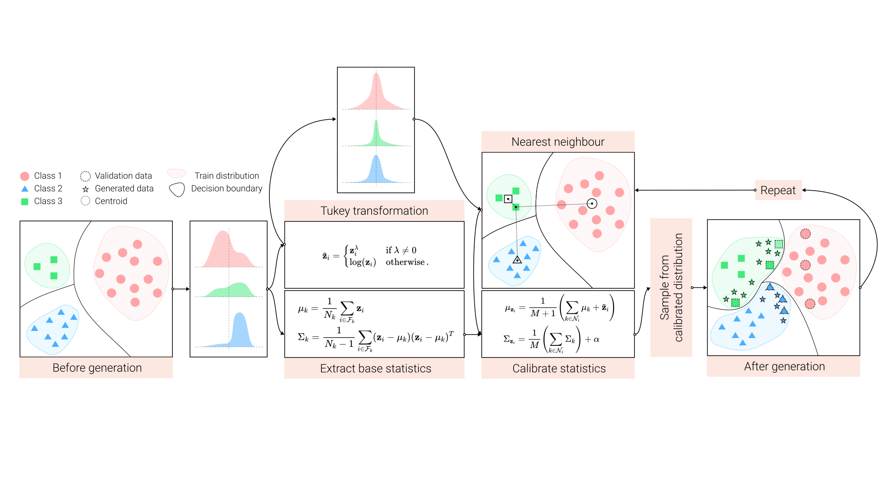
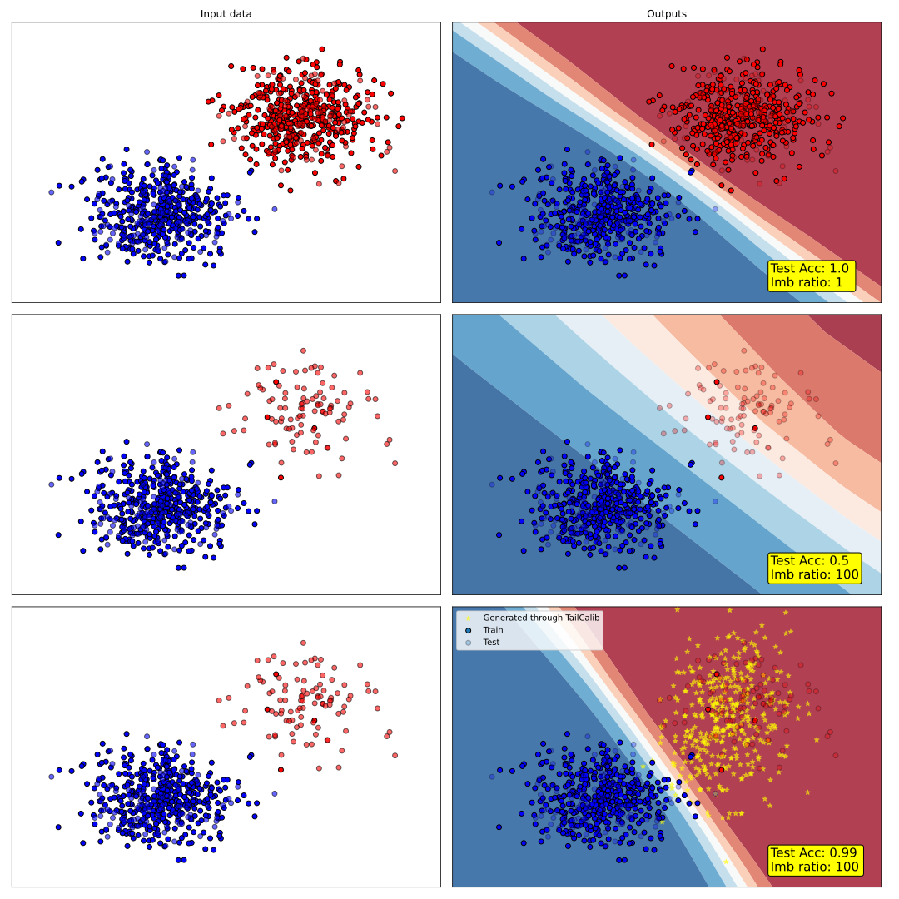

# TailCalibX : Feature Generation for Long-tail Classification
by [Rahul Vigneswaran](https://rahulvigneswaran.github.io/), [Marc T. Law](http://www.cs.toronto.edu/~law/), [Vineeth N. Balasubramanian](https://lab1055.github.io/), [Makarand Tapaswi](https://makarandtapaswi.github.io/)



# Table of contents
  - [🐣 Easy Usage (Recommended way to use our method)](#-easy-usage-recommended-way-to-use-our-method)
    - [💻 Installation](#-installation)
    - [👨‍💻 Example Code](#-example-code)
  - [🧪 Advanced Usage](#-advanced-usage)
    - [✔ Things to do before you run the code from this repo](#-things-to-do-before-you-run-the-code-from-this-repo)
    - [📀 How to use?](#-how-to-use)
    - [📚 How to create the mini-ImageNet-LT dataset?](#-how-to-create-the-mini-imagenet-lt-dataset)
    - [⚙ Arguments](#-arguments)
  - [🏋️‍♂️ Trained weights](#%EF%B8%8F%EF%B8%8F-trained-weights)
  - [🪀 Results on a Toy Dataset](#-results-on-a-toy-dataset)
  - [🌴 Directory Tree](#-directory-tree)
  - [📃 Citation](#-citation)
  - [👁 Contributing](#-contributing)
  - [❤ About me](#-about-me)
  - [✨ Extras](#-extras)
  - [📝 License](#-license)
  
## 🐣 Easy Usage (Recommended way to use our method)
⚠ **Caution:**  TailCalibX is just TailCalib employed multiple times. Specifically, we generate a set of features once every epoch and use them to train the classifier. In order to mimic that, three things must be done at __every epoch__ in the following order:
1. Collect all the features from your dataloader.
2. Use the `tailcalib` package to make the features balanced by generating samples.
3. Train the classifier.
4. Repeat.

### 💻 Installation
Use the package manager [pip](https://pip.pypa.io/en/stable/) to install __tailcalib__.

```bash
pip install tailcalib
```

### 👨‍💻 Example Code
 Check the instruction [here](tailcalib_pip/README.md) for a much more detailed python package information.

```python
# Import
from tailcalib import tailcalib

# Initialize
a = tailcalib(base_engine="numpy")   # Options: "numpy", "pytorch"

# Imbalanced random fake data
import numpy as np
X = np.random.rand(200,100)
y = np.random.randint(0,10, (200,))

# Balancing the data using "tailcalib"
feat, lab, gen = a.generate(X=X, y=y)

# Output comparison
print(f"Before: {np.unique(y, return_counts=True)}")
print(f"After: {np.unique(lab, return_counts=True)}")
```

## 🧪 Advanced Usage

### ✔ Things to do before you run the code from this repo
- Change the `data_root` for your dataset in `main.py`.
- If you are using wandb logging ([Weights & Biases](https://docs.wandb.ai/quickstart)), make sure to change the `wandb.init` in `main.py` accordingly.

### 📀 How to use?
- For just the methods proposed in this paper :
    - For CIFAR100-LT: `run_TailCalibX_CIFAR100-LT.sh`
    - For mini-ImageNet-LT : `run_TailCalibX_mini-ImageNet-LT.sh`
- For all the results show in the paper :
    - For CIFAR100-LT: `run_all_CIFAR100-LT.sh`
    - For mini-ImageNet-LT : `run_all_mini-ImageNet-LT.sh`

### 📚 How to create the mini-ImageNet-LT dataset?
Check `Notebooks/Create_mini-ImageNet-LT.ipynb` for the script that generates the mini-ImageNet-LT dataset with varying imbalance ratios and train-test-val splits.
### ⚙ Arguments
- `--seed` : Select seed for fixing it. 
    - Default : `1`
- `--gpu` : Select the GPUs to be used. 
    - Default : `"0,1,2,3"`

- `--experiment`: Experiment number (Check 'libs/utils/experiment_maker.py'). 
    - Default : `0.1`
- `--dataset` : Dataset number. 
    - Choices : `0 - CIFAR100, 1 - mini-imagenet` 
    - Default : `0`
- `--imbalance` : Select Imbalance factor. 
    - Choices : `0: 1, 1: 100, 2: 50, 3: 10` 
    - Default : `1`
- `--type_of_val` : Choose which dataset split to use. 
    - Choices: `"vt": val_from_test, "vtr": val_from_train, "vit": val_is_test`
    - Default : `"vit"`

- `--cv1` to `--cv9` : Custom variable to use in experiments - purpose changes according to the experiment.
    - Default : `"1"`    

- `--train` : Run training sequence
    - Default : `False`
- `--generate` : Run generation sequence
    - Default : `False`
- `--retraining` : Run retraining sequence
    - Default : `False`
- `--resume` : Will resume from the 'latest_model_checkpoint.pth' and wandb if applicable.
    - Default : `False`

- `--save_features` : Collect feature representations.
    - Default : `False`
- `--save_features_phase` : Dataset split of representations to collect.
    - Choices : `"train", "val", "test"`
    - Default : `"train"`

- `--config` : If you have a yaml file with appropriate config, provide the path here. Will override the 'experiment_maker'.
    - Default : `None`

## 🏋️‍♂️ Trained weights
| Experiment       | CIFAR100-LT (ResNet32, seed 1, Imb 100) | mini-ImageNet-LT (ResNeXt50)|
| -----------      | -----------        | -----------        |
| TailCalib        | [Git-LFS](https://downgit.github.io/#/home?url=https://github.com/rahulvigneswaran/trained_models/tree/main/TailCalibX/CIFAR100-LT/TailCalib)       | [Git-LFS](https://downgit.github.io/#/home?url=https://github.com/rahulvigneswaran/trained_models/tree/main/TailCalibX/mini-ImageNet-LT/TailCalib)       |
| TailCalibX       | [Git-LFS](https://downgit.github.io/#/home?url=https://github.com/rahulvigneswaran/trained_models/tree/main/TailCalibX/CIFAR100-LT/TailCalibX)        |[Git-LFS](https://downgit.github.io/#/home?url=https://github.com/rahulvigneswaran/trained_models/tree/main/TailCalibX/mini-ImageNet-LT/TailCalibX)        |
| CBD + TailCalibX | [Git-LFS](https://downgit.github.io/#/home?url=https://github.com/rahulvigneswaran/trained_models/tree/main/TailCalibX/CIFAR100-LT/CBD%2BTailCalibX)        |[Git-LFS](https://downgit.github.io/#/home?url=https://github.com/rahulvigneswaran/trained_models/tree/main/TailCalibX/mini-ImageNet-LT/CBD%2BTailCalibX)        |

## 🪀 Results on a Toy Dataset 
[](https://colab.research.google.com/drive/1Yj2qymSm3NgCBqvKn5r_cOiEFl9wGp3J?usp=sharing)

The higher the `Imb ratio`, the more imbalanced the dataset is.
`Imb ratio = maximum_sample_count / minimum_sample_count`.

Check [this notebook](https://colab.research.google.com/drive/1Yj2qymSm3NgCBqvKn5r_cOiEFl9wGp3J?usp=sharing) to play with the toy example from which the plot below was generated.


## 🌴 Directory Tree
```bash
TailCalibX
├── libs
│   ├── core
│   │   ├── ce.py
│   │   ├── core_base.py
│   │   ├── ecbd.py
│   │   ├── modals.py
│   │   ├── TailCalib.py
│   │   └── TailCalibX.py
│   ├── data
│   │   ├── dataloader.py
│   │   ├── ImbalanceCIFAR.py
│   │   └── mini-imagenet
│   │       ├── 0.01_test.txt
│   │       ├── 0.01_train.txt
│   │       └── 0.01_val.txt
│   ├── loss
│   │   ├── CosineDistill.py
│   │   └── SoftmaxLoss.py
│   ├── models
│   │   ├── CosineDotProductClassifier.py
│   │   ├── DotProductClassifier.py
│   │   ├── ecbd_converter.py
│   │   ├── ResNet32Feature.py
│   │   ├── ResNext50Feature.py
│   │   └── ResNextFeature.py
│   ├── samplers
│   │   └── ClassAwareSampler.py
│   └── utils
│       ├── Default_config.yaml
│       ├── experiments_maker.py
│       ├── globals.py
│       ├── logger.py
│       └── utils.py
├── LICENSE
├── main.py
├── Notebooks
│   ├── Create_mini-ImageNet-LT.ipynb
│   └── toy_example.ipynb
├── readme_assets
│   ├── method.svg
│   └── toy_example_output.svg
├── README.md
├── run_all_CIFAR100-LT.sh
├── run_all_mini-ImageNet-LT.sh
├── run_TailCalibX_CIFAR100-LT.sh
└── run_TailCalibX_mini-imagenet-LT.sh
```
Ignored `tailcalib_pip` as it is for the `tailcalib` pip package.


## 📃 Citation
```
@inproceedings{rahul2021tailcalibX,
    title   = {{Feature Generation for Long-tail Classification}},
    author  = {Rahul Vigneswaran and Marc T. Law and Vineeth N. Balasubramanian and Makarand Tapaswi},
    booktitle = {ICVGIP},
    year = {2021}
}
```

## 👁 Contributing
Pull requests are welcome. For major changes, please open an issue first to discuss what you would like to change.

## ❤ About me
[Rahul Vigneswaran](https://rahulvigneswaran.github.io/)

## ✨ Extras
[🐝  Long-tail buzz](https://rahulvigneswaran.github.io/longtail-buzz/) : If you are interested in deep learning research which involves __long-tailed / imbalanced__ dataset, take a look at [Long-tail buzz](https://rahulvigneswaran.github.io/longtail-buzz/) to learn about the recent trending papers in this field.


## 📝 License
[MIT](LICENSE)
